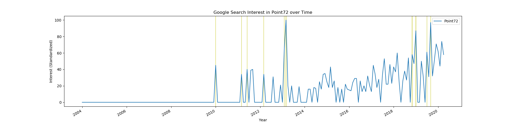

# huginn
Named for one of the Norse god Odin's ravens who would gather information for him. A package to facilitate the investigation of anomalous spikes in public interest in an entity, then fetch and summarize news stories relevant to those spikes.

# Installation and Setup

Requires Python=3.6

`huginn` is [available on PyPi](<https://pypi.org/project/huginn/>) and installable via pip:

```pip install huginn``` 

## Spacy models

Download English spacy models by running the following in the command line: 

```
$ python3 -m spacy download en
```

## NYT API Key

This project requires the usage of the New York Times article search API.  Request a key at [developer.nytimes.com](developer.nytimes.com). You'll need to set your NYT API key as a system environment variable. Open the file `~/.bashrc` (or `~/.bash_profile` if the `.bashrc` doesn't exist) in any Unix based system (Mac, Ubuntu, etc), and add the following two lines to the end of the file: 

```
# Setting NYT API Key as an environment variable
export NYT_API_KEY="YOUR_KEY_HERE"
```

Where `YOUR_KEY_HERE`is your NYT API key, enclosed in quotes.

This  is necessary for requesting relevant links for a potential entity's anomalies.

# Usage

huginn is based around the `Huginn` object. A user only need provide the entity that they are interested in.

```python
from huginn import Huginn

point72 = Huginn('Point72')
```

At this point huginn fetches Google Trends search interest on this entity looking back to 2003.  We can then find the most anomalous dates and plot the Google trends search interest with the anomalies:

```python
point72.get_anomalies()
point72.plot_interest_with_anomalies()
```

We then fetch news articles and relevant information related to our anomalies:

```
point72.get_articles_info()
```

Now we can get summaries, either specific to each anomaly or globally:

```
point72.get_global_summary()
point72.get_articles_info_and_summary_after_LDA()
```

These require downloading some rather large summarization models to run.